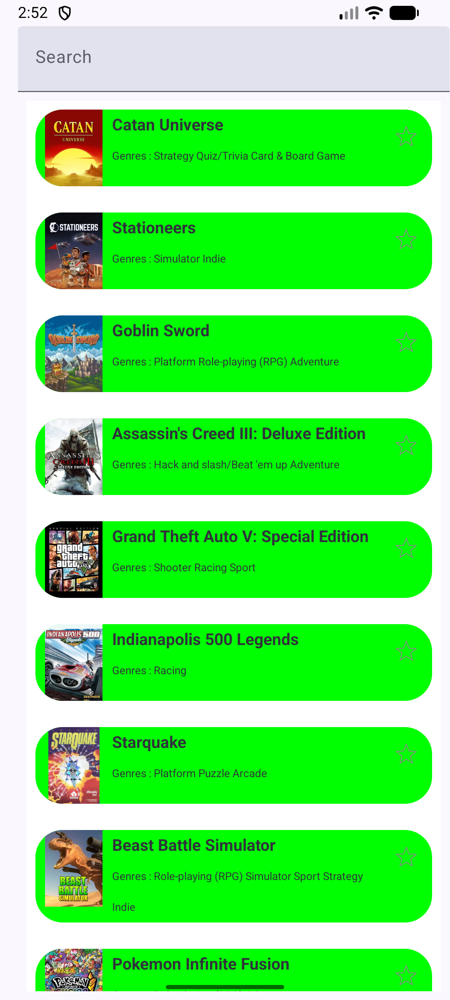
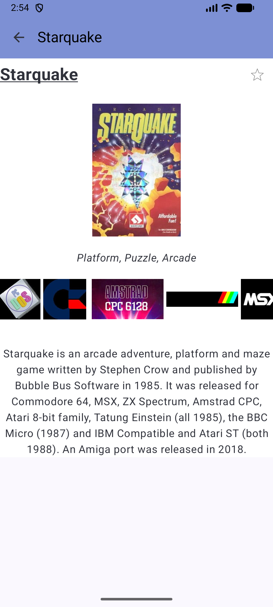

# Projet Programmation Mobile - Basma Salem ET Victoire Peltier
Année scolaire 2025-2026

## MyGamesList
Une application Android pour gérer sa collection de jeux vidéo

## Aperçu de l'application

<div align="center">

#### Liste des jeux & Détails d'un jeu




</div>

## Fonctionnalités implémentées
Les TP obligatoires ont été complétés.
Concernant les bonus :
* Accessibilité : couleurs contrastées, ajout de descriptions (contentDescription), modifier semantics sur les objets cliquables
* Croix dans la barre de recherche pour effacer le texte écrit jusque là
* Favoris persistants : utilisation de dao

## Structure du projet
```
app/src/main/java/com/insa/mygameslist/
|data/
    |- favoris.kt               # Gestion toggle favoris et persistance
    |- fonctions2.kt            # Composants UI (cellules, écrans)
    |- IGDB.kt                  # Chargement des données
    |- JeuxDao.kt               # Interface DAO pour Room
    |- navigation.kt            # Configuration navigation
    |- persistenceButton.kt     # Logique du bouton favoris
    |- SearchBar.kt             # Barre de recherche avec filtrage
|-- ui.theme/
    |- [fichiers de thème (Color.kt, Theme.kt, Type.kt)]
|-- MainActivity.kt             # Point d'entrée + scaffolds
``` 

## Sources et documentation
Les ressources suivantes ont été consultées pour la réalisation de ce projet :
* https://developer.android.com/?hl=fr
* https://developer.android.com/develop/ui/compose/documentation?hl=fr
* https://developer.android.com/guide/navigation/navigation-3?hl=fr
* https://developer.android.com/training/data-storage/room?hl=fr
* Tutoriels et vidéos youtube 

